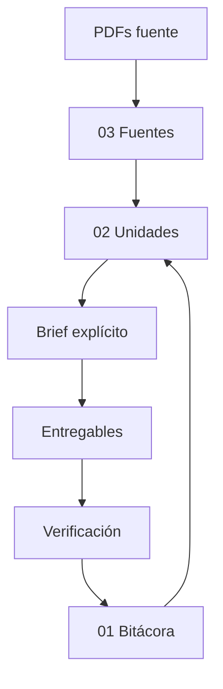

# Organigrama del vault

```mermaid
flowchart TD
    F[PDFs fuente] --> S[03 Fuentes]
    S --> U[02 Unidades]
    U --> B[Brief explícito]
    B --> E[Entregables]
    E --> V[Verificación]
    V --> L[01 Bitácora]
    L --> U
```

Los PDFs se preservan; las notas citan su página. Cada material debe poder rastrearse a una semana y a una fuente.
